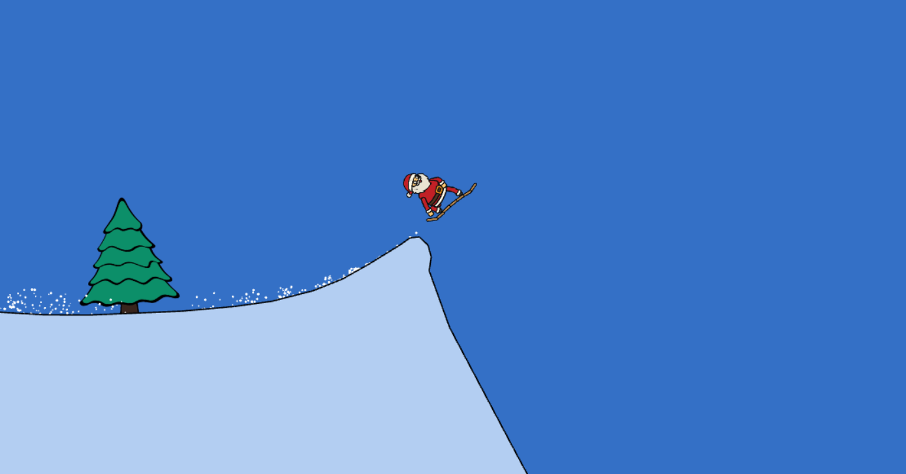

# Snowboarding Game

<p align="center">

</p>


## How to play?

&nbsp;&nbsp;&nbsp;<kbd>&uarr;</kbd> &nbsp;&nbsp;&nbsp;&nbsp;Jump (hold to jump with full power)<br>
<kbd>&larr;</kbd> <kbd>&rarr;</kbd> &nbsp; Rotate and flip<br>
&nbsp;&nbsp;&nbsp;<kbd>&darr;</kbd> &nbsp;&nbsp;&nbsp; Bend legs (spin faster while in air)

<kbd>SPACE</kbd> or <kbd>ESC</kbd> Open Menu (Also pauses the game)


Collect the "presents" and flip around while in the air to gain points until the end of the level.

Don't let the combo counter run out (see top center of GUI) to increase your score. Crash and you will lose all your pending combo points.

## Technical Details
A box2d based snowboarding game made with Phaser 3 and TypeScript.

Levels are created with [R.U.B.E](https://www.iforce2d.net/rube/) (Really Useful Box2D Editor) which made it easier to create levels and export them as JSON files.

The JSON files are then loaded into the game using a loader that is part of this project 

_Loader might be useful for any project that uses Phaser3 and [Birch-san/box2d-wasm](https://github.com/Birch-san/box2d-wasm). I want to turn it into a NPM package and create adapters to support various box2d ports_

For the GUI and menus, plain old HTML/CSS is used and rendered on top of the canvas. This will likely change as it is a bit of a pain to maintain.

At this point I'm not too concerned with super clean architechture and code quality. You will see some messy code and unstructured commits that I clean up as things take shape.

Eventually I want to add a level editor to the game and build infrastructure to allow players to share their levels with each other, rate them and so on. Each level would have their own leaderboard.

I would really like for the physics to be fully deterministic so I can store input data (for replays and ghosts) along with the scores. That probably won't be possible using box2d cross all platforms, so will experiment switching to the Rapier physics engine (possibly switching from TS to Rust altogether in the process).

## Run the game locally
```shell
 git clone https://github.com/andreas-schoch/snowboarding-game.git
 cd snowboarding-game
 npm i
 npm run start
```
[How to create levels](./docs/how-to-create-levels.md)

[How to create Characters](./docs/how-to-create-characters.md)

## License
GPL-3.0 License

(Note: Project may contain assets that are licensed differently in which cases the license is indicated within the assets folder)
